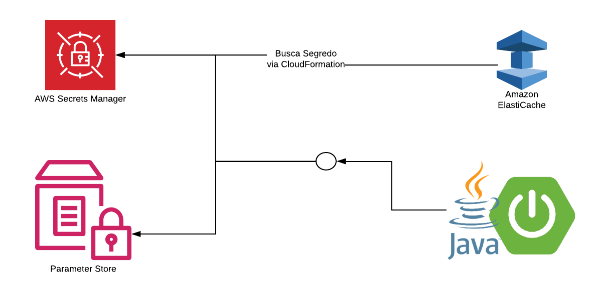
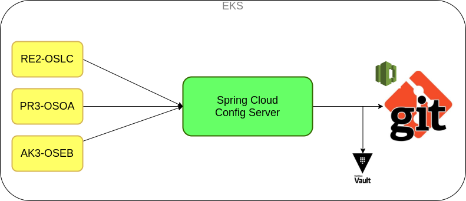

# AWS

### Spring Boot :: Secrets Manager :: Parameter Store :: ElastiCache

##### Config Server

   
`Prós:`   
    - Configuração Centralizada   
    - Refresh Scope: Atualizar configurações OnTheFly   

`Contras:`   
    - Aplicações devem ser construídas em Java/Spring   
    - Serviço dedicado   

##### Configmap Kubernetes

`Prós:`   
    - Solução única indepêndente de Linguagem   
   
`Contras:`   
    - Arquivo local no Kubernets   
    - Para refletir atualização da configuração precisa de um novo deploy   
