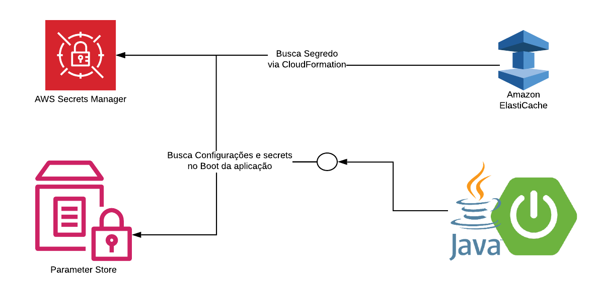

# AWS

### Spring Boot :: Secrets Manager :: Parameter Store :: ElastiCache

Configurações de Aplicações é algo que veio evoluindo com a necessidade e o passar do tempo, primeiramente utilizamos as configurações dentro do código, como por exemplo host, porta e usuario de um banco de dados. Depois passavamos via parametro ao iniciar a aplicação ou criando arquivos de configurações fora da aplicação.    
   
Com o surgimento da Cloud e com a possibilidade de termos vários ambientes (desenvolvimento, homologação e produção), podendo ser IAAS, PAAS, SAAS, [FAAS](https://en.wikipedia.org/wiki/Function_as_a_service), BAAS e foi ficando cada vez mais complexo gerenciar essas configurações, para adicionar um pouco mais de complexidade temos escalabilidade horizontal, Blue-Green, Canary-Release e várias entregas em paralelo.   
   
Pensando nisso um grupo de desenvolvedores criaram os 12 fatores para a sua aplicação rodar na nuvem. E um desses 12 fatores é as [Configurações](https://12factor.net/pt_br/config).   
   
Você pode utilizar arquivos de properties para gerenciar essas configurações de aplicações criando uma para cada ambiente, no Spring temos o application.properties ou application.yml que facilita muito nossa vida (mas nem sempre foi assim).   
   
Em uma arquitetura de Cluster, ao alterar a configuração de um microservice, todas as instâncias devem ser alteradas. Nesse caso se você tem as configurações centralizadas, concorda que seria sensacional as instâncias fossem atualizadas On-The-Fly? Se você utiliza o ecossistema Spring, neste caso temos o Spring Cloud Config Server.   

No nosso caso como utilizamos Cloud pública AWS, podemos utilizar o AWS ParameterStore para centralizar nossas configurações.   

#### Parameter Store

Criando um parametro

#### CloudFormation

...

#### Spring Clous AWS

...

#### Secrets Manager

Criando um secret

--- 

##### Config Server

   
`Prós:`   
    - Configuração Centralizada   
    - Refresh Scope: Atualizar configurações OnTheFly   

`Contras:`   
    - Aplicações devem ser construídas em Java/Spring   
    - Serviço dedicado   

##### Configmap Kubernetes

`Prós:`   
    - Solução única indepêndente de Linguagem   
   
`Contras:`   
    - Arquivo local no Kubernets   
    - Para refletir atualização da configuração precisa de um novo deploy   
